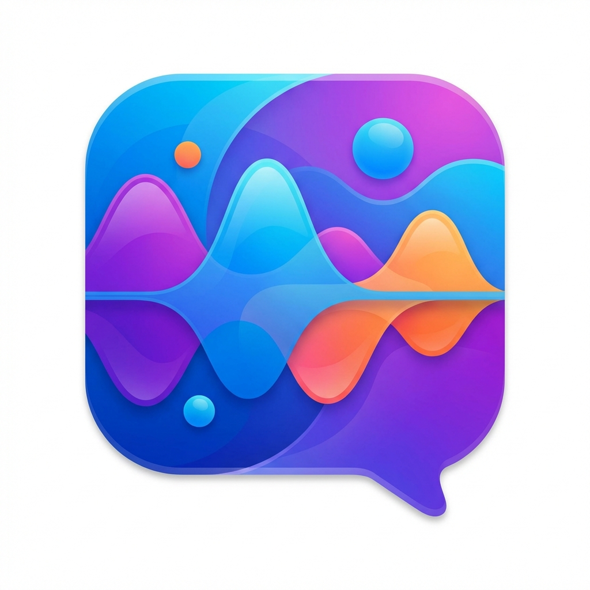

<p align="center">
  
</p>

# GabGab 🗣️

<div align="center">


</div>

<p align="center">
  <strong>A quirky, local-first voice processing application for macOS.</strong><br>
  <em>Because talking to your computer should be fun, not creepy!</em>
</p>

GabGab provides high-quality text-to-speech and speech-to-text capabilities entirely on-device using Apple's MLX framework and optimized models.

## Features

- 🎵 **High-Quality TTS**: Local text-to-speech using Kokoro and LFM models
- 🎧 **Accurate STT**: Local speech-to-text using Parakeet models
- 🤖 **MCP Server**: Model Context Protocol server for AI agent integration
- 💻 **Command Line Interface**: Full-featured CLI for batch processing
- 🔄 **Intelligent Routing**: Automatic local/cloud fallback based on urgency
- 🚀 **Apple Silicon Optimized**: Native performance on M1/M2/M3 chips
- 🔒 **Privacy-First**: Process voice locally, never send data to cloud

## Quick Start

### Installation

```bash
# Clone the repository
git clone <repository-url>
cd MLXVoice

# Build the application
swift build -c release

# Install executables (optional)
sudo cp .build/release/mlx-voice-cli /usr/local/bin/
sudo cp .build/release/mlx-voice-mcp-server /usr/local/bin/
```

### Basic Usage

```bash
# Generate speech
mlx-voice-cli tts "Hello, world!" --output greeting.wav

# Transcribe audio
mlx-voice-cli stt recording.wav

# Check server status
mlx-voice-cli health
```

### MCP Server Usage

```bash
# Start MCP server for AI integration
mlx-voice-mcp-server
```

## Architecture

### Core Components

- **MLXVoice**: Core Swift actor for voice processing
- **mlx-voice-cli**: Command-line interface tool
- **mlx-voice-mcp-server**: Model Context Protocol server
- **Voice Router**: Intelligent local/cloud routing system

### Supported Models

#### TTS Models

- **Kokoro-82M**: Fast, lightweight (~82M parameters)
- **LFM-2.5-Audio-1.5B**: High-quality, expressive voices
- **ElevenLabs**: Cloud fallback for time-critical requests

#### STT Models

- **Parakeet-0.6B**: Fast local transcription
- **Whisper Large v3 Turbo**: High-accuracy fallback
- **Smart Turn v3.2**: Voice activity detection

## Performance

- **TTS Latency**: <5 seconds for local models, <2 seconds cloud
- **STT Accuracy**: State-of-the-art local performance
- **Memory Usage**: ~1.5GB for LFM models, ~200MB for Kokoro
- **Quality Target**: UTMOS >3.5 (ElevenLabs equivalent)

## Integration

### With Briefly (Daily Briefing App)

MLXVoice serves as the local voice engine for [Briefly](https://github.com/your-org/briefly), providing:

- Daily brief voice generation without API costs
- Privacy-preserving local processing
- Seamless fallback to cloud for urgent requests

### With AI Agents

The MCP server enables AI assistants to:

- Generate natural speech responses
- Transcribe voice messages
- Check voice processing status
- Access voice model information

## Development

### Requirements

- macOS 14.0+
- Swift 6.2+
- Apple Silicon (M1/M2/M3) recommended
- MLX framework installed

### Building

```bash
swift build                    # Debug build
swift build -c release        # Release build
swift test                    # Run tests
```

### Project Structure

```text
MLXVoice/
├── Sources/
│   ├── MLXVoice/             # Core voice processing
│   ├── mlx-voice-cli/        # CLI executable
│   └── mlx-voice-mcp-server/ # MCP server executable
├── Tests/
│   └── MLXVoiceTests/
├── Package.swift             # Swift Package configuration
└── README.md                # This file
```

## Configuration

### Environment Variables

```bash
# MLX server URL (default: http://127.0.0.1:8080)
MLX_VOICE_SERVER_URL=http://localhost:8080

# Cloud fallback API key (optional)
ELEVENLABS_API_KEY=your-api-key-here
```

### Model Storage

Models are stored in `~/models/voice-mlx/`:

```text
~/models/voice-mlx/
├── kokoro-82m-bf16/          # Kokoro TTS model
├── parakeet-tdt-0.6b-v3/     # Parakeet STT model
├── lfm2.5-audio-1.5b-4bit/   # LFM high-quality TTS
└── whisper-large-v3-turbo/   # Whisper fallback
```

## API Reference

### CLI Commands

#### TTS Command

```bash
mlx-voice-cli tts <text> [options]
Options:
  --voice <voice>        Voice ID (default: af_heart)
  --output <file>        Output file (default: speech.wav)
  --server <url>         MLX server URL
  --play                 Play audio after generation
  --urgency <level>      high|normal (default: normal)
```

#### STT Command

```bash
mlx-voice-cli stt <audio-file> [options]
Options:
  --server <url>         MLX server URL
```

### MCP Tools

- `voice/generate_speech`: Generate speech from text
- `voice/transcribe_audio`: Transcribe audio to text
- `voice/check_health`: Check server status
- `voice/list_voices`: List available voices

## Contributing

1. Fork the repository
2. Create a feature branch
3. Make your changes
4. Add tests
5. Submit a pull request

## License

[Your License Here]

## Acknowledgments

- Built on Apple's MLX framework
- Inspired by local-first voice processing initiatives
- Thanks to the MLX community for model optimizations
